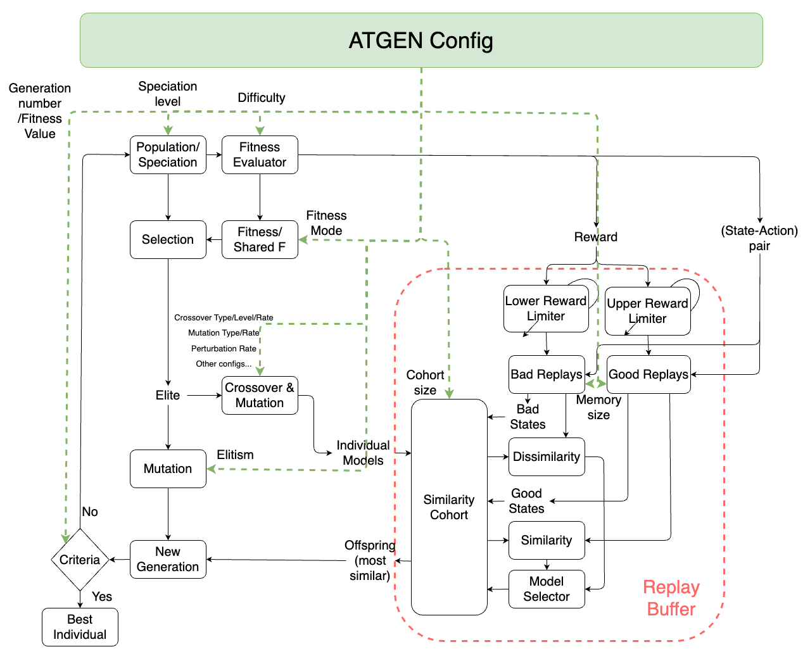
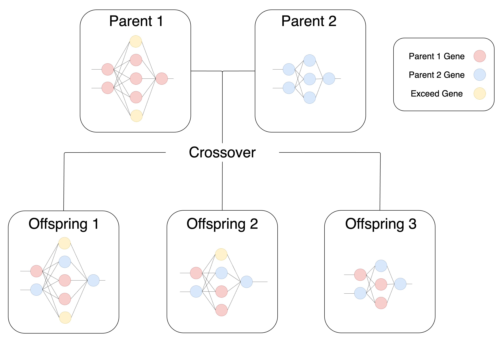
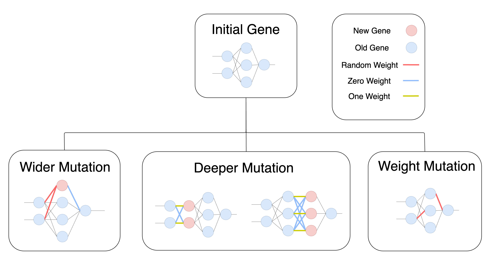

# Adaptive Tensor of Augmented Topology (ATGEN)

**Adaptive Tensor of Augmented Topology (ATGEN)** is a novel evolutionary framework designed to optimize neural networks for control and reinforcement learning (RL) tasks. Leveraging adaptive genetic algorithms, ATGEN enhances the process of evolving neural network architectures and weights, surpassing the limitations of traditional backpropagation-based training.


This repository contains the implementation of ATGEN, focusing on dynamically evolving neural networks by tuning both topology and weights over generations. ATGEN optimizes the balance between exploration and exploitation through an adaptive approach, which adjusts mutation rates and crossover parameters based on the state of the population and the fitness landscape. This mechanism accelerates convergence while ensuring robustness in finding optimal or near-optimal solutions in large search spaces.

---

## Video Demo
<video src="https://github.com/AhmedBoin/atgen/raw/main/Playback.mp4" controls>
  Your browser does not support the video tag.
</video>

---

### Key Features
- **Dynamic Evolution of Network Topology and Weights**: ATGEN allows for networks to evolve both structurally (adding/removing layers, adjusting filters) and parametrically (modifying weights), adapting to the problem at hand.


- **Exploration-Exploitation Tradeoff**: ATGEN starts with a high mutation rate for global exploration, gradually decaying to emphasize exploitation as the search progresses. This strategy ensures that the algorithm quickly discovers promising solutions and refines them efficiently.
- **Support for Continuous and Discrete Action Spaces**: ATGEN is capable of optimizing models that operate in both continuous and discrete action spaces, making it highly versatile for a variety of RL tasks.
- **Genetic Algorithm Enhancements**: The framework includes advanced genetic techniques such as speciation, elite selection, and crossover methods (e.g., order-based, uniform) to optimize performance.
- **Integrated Fitness Evaluation**: ATGEN calculates fitness scores based on rewards or other user-defined metrics, and utilizes a selective mechanism to ensure only the most promising individuals progress to future generations.
- **Neural Network Blending Mechanism** along side of Identity usage, introducing an alternative blending mechanism for activation function to compromise between linearity and non-linearity


---

### How It Works
1. **Population Initialization**: The initial population is generated, containing individuals (neural networks) with randomized weights and architecture.
2. **Fitness Evaluation**: Each individual is evaluated based on a fitness function, which could be the reward obtained in an RL task or any other predefined objective.
3. **Evolution Process**: ATGEN evolves the population over generations. High-fitness individuals are selected for crossover and mutation to create offspring, while low-fitness individuals are discarded. A portion of the population, known as elites, is preserved to maintain high-quality solutions.
4. **Exploration to Exploitation Shift**: Initially, ATGEN focuses on exploration by using high mutation and crossover rates, which gradually decay to favor exploitation as the search narrows in on promising regions of the solution space.
5. **Similarity Calculation**: For continuous action spaces, ATGEN uses cosine similarity to compare individuals, while for discrete actions, one-hot encoding combined with exponential moving average (EMA) is employed to smooth actions and simulate a continuous space. The most similar individuals in each cohort are selected to move forward.

---

### Applications
ATGEN is designed to excel in environments that require both neural network optimization and adaptability, particularly in control tasks such as:
- **Reinforcement Learning Games**: Optimizing agents for complex environments like OpenAI Gym's CarRacing and LunarLander.
- **Control Systems**: Adapting neural networks for autonomous systems, robotics, and other control-based applications.
- **Optimization Problems**: Solving large-scale optimization challenges that require fine-tuning of both architecture and weights.
- **Computer Vision Support**: new innovative way to handle CNN for GA Agent.

---

### How to Use
1. **Installation**: Clone the repository and install the necessary dependencies listed in `requirements.txt`.
   ```bash
   git clone https://github.com/AhmedBoin/atgen.git
   cd atgen
   pip install -r requirements.txt
   ```

2. **Run an Example**: You can test ATGEN on a simple control task by running the following:
   ```bash
   python run_experiment.py --config config/car_racing.json
   ```

3. **Custom Configurations**: Modify the `ATGENConfig` class or YAML configuration files to adjust parameters such as mutation rates, crossover methods, and population size.

### Citation
If you use any idea purposed in ATGEN in your research or projects, please cite the paper:

```bibtex
@article{taha2024revival,
  title={The Revival of Natural Selection},
  author={Mohamed A. Taha},
  journal={To be published},
  year={2024},
  institution={Mansoura University}
}
```

### License
This project is licensed under the MIT License - see the [LICENSE](LICENSE) file for details.

---
